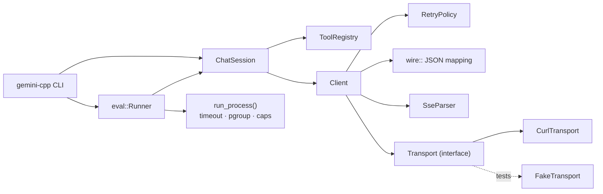

# gemini-cpp

[](https://github.com/eddieabasi/gemini-cpp/actions/workflows/ci.yml)

A modern C++23 client for the **Google Gemini API**, plus an **evaluation harness that finds where a coding model breaks**: Gemini writes C++ for a task, the harness compiles it, runs hidden tests (optionally under ASan/UBSan), sorts each failure into a category, and can feed compiler/test output back to the model for repair rounds.

```text
$ gemini-cpp eval --jobs 4 --repair 1 --sanitize
Evaluating 6 task(s) with gemini-2.5-flash (jobs=4, repair=1, sanitizers)
[1/6] lru-cache: pass (1 attempt)
[2/6] parse-duration: test_failure (2 attempts)
      exit code 1
      tests.cpp:71: CHECK failed: invalid("9223372036854775808ns")
...
| pass@1            | 4/6 (66.7%) |
| pass after repair | 5/6 (83.3%) |
```

(The numbers above only show the format. Real scores depend on the model and change from run to run.)

## Highlights

**Client library (`gemini::gemini`)**
- `generateContent`, SSE `streamGenerateContent`, `countTokens` and paginated `models` listing.
- Errors are values (`std::expected<T, gemini::Error>`), not exceptions. Each error has a category (`rate_limited`, `server`, `blocked`, …) that decides whether the call is retried.
- Retries use exponential backoff with jitter. The client follows the server's `google.rpc.RetryInfo` / `Retry-After` hints.
- A failed stream is retried only if no chunk has reached the caller yet, so callers never see duplicated text.
- Multi-turn `ChatSession` with automatic function calling. Its history is rolled back if a call fails, and it sends back **thought signatures** (which thinking models need for multi-turn tool use).
- Built-in tools: `get_current_time` and a safe recursive-descent `evaluate_expression` calculator (it never evaluates or executes the input as code).
- Thread-safe `Client`. The libcurl transport keeps one handle per thread, so keep-alive connections are reused.
- Metrics (requests, attempts, retries, tokens, latency) and structured logging as text or JSON lines.
- The network layer sits behind a `Transport` interface, so the test suite needs no network.

**Evaluation harness (`gemini::eval`)**
- A task is a directory with a spec, hidden `tests.cpp`, and a `reference.hpp` that proves the tests are correct. CI runs the tests against every reference, so the benchmark checks itself.
- Each attempt is classified as `pass`, `compile_error`, `test_failure`, `timeout`, `crash` (signal or sanitizer report), `no_code`, `api_error` or `harness_error`.
- Child processes run with a wall-clock timeout in their own process group, so forked grandchildren are killed too. Output is capped, stdin is `/dev/null`, core dumps are off, and memory is limited with `RLIMIT_AS` on Linux.
- The timeout clock starts only when the test binary reaches `main()` (via a start marker from `check.hpp`). Otherwise OS launch delays, such as macOS checking a new binary (which can take seconds under load), would be counted as test time.
- Tasks run in parallel. Reports come as Markdown (pass@1, pass after repair, most informative error line per task) and as JSON (every attempt, with source and logs).

## Build

Requirements: CMake ≥ 3.25, a C++23 compiler (GCC 13+, Clang 17+ / Apple Clang 15+), libcurl. nlohmann/json and GoogleTest are fetched automatically if they aren't already installed.

```bash
# Ubuntu: sudo apt-get install cmake ninja-build g++ libcurl4-openssl-dev
# macOS:  brew install cmake ninja
cmake -S . -B build -G Ninja
cmake --build build
ctest --test-dir build --output-on-failure
```

Options: `-DGEMINI_SANITIZE=ON` (ASan+UBSan), `-DGEMINI_WERROR=ON`, `-DGEMINI_BUILD_TESTS=OFF`, `-DGEMINI_BUILD_EXAMPLES=OFF`.

## CLI

```bash
export GEMINI_API_KEY=...            # https://aistudio.google.com/apikey
export GEMINI_MODEL=gemini-2.5-flash # optional; or pass --model

gemini-cpp ask "Explain std::launder in two sentences"
git diff | gemini-cpp ask --system "You are a strict C++ reviewer" -
gemini-cpp chat --tools              # multi-turn, with tool calling
gemini-cpp tokens "How many tokens is this?"
gemini-cpp models

gemini-cpp eval                                  # all tasks, one attempt each
gemini-cpp eval --jobs 4 --repair 2 --sanitize   # parallel, 2 repair rounds, ASan+UBSan
gemini-cpp eval --task spsc-queue --keep         # keep the build dir for inspection
gemini-cpp eval --report-json r.json --report-md r.md --min-pass 0.8
gemini-cpp eval --reference                      # check the benchmark itself, no API calls
```

`gemini-cpp --help` lists every option. Exit codes: `0` success, `1` API/eval failure (or pass rate below `--min-pass`), `2` usage error.

## Library usage

```cpp
#include "gemini/gemini.hpp"

auto options = gemini::ClientOptions::from_env();   // Result<ClientOptions>
if (!options) { std::cerr << options.error().describe(); return 1; }
gemini::Client client(std::move(*options));

// Streaming
gemini::GenerateRequest req;
req.system_instruction = gemini::Content::user("Be terse.");
req.contents.push_back(gemini::Content::user("Three pitfalls of std::shared_ptr?"));
req.config.temperature = 0.3;
auto reply = client.stream(req, [](const gemini::GenerateResponse& chunk) {
  std::cout << chunk.text() << std::flush;
  return true;                                       // false cancels
});

// Chat with tools
gemini::ToolRegistry tools;
tools.add({"lookup_order", "Looks up an order by id",
           {{"type", "object"}, {"properties", {{"id", {{"type", "string"}}}}}, {"required", {"id"}}}},
          [](const nlohmann::json& args) -> gemini::Result<nlohmann::json> {
            return nlohmann::json{{"status", "shipped"}, {"id", args["id"]}};
          });
gemini::ChatSession chat(client, {.system_instruction = "You are a support agent."}, &tools);
auto answer = chat.send("Where is order A-17?");
```

A runnable version is in [`examples/quickstart.cpp`](examples/quickstart.cpp). To use the library from another CMake project, add it with `add_subdirectory` and link `gemini::gemini` (and `gemini::eval` if you need the harness).

## Architecture



| Path | What it holds |
|---|---|
| `include/gemini/` | Public client API: `client.hpp`, `chat.hpp`, `tools.hpp`, `types.hpp`, `error.hpp`, … |
| `include/gemini/eval/` | Harness API: tasks, runner, process sandboxing, code extraction |
| `src/` | Implementation (libcurl only appears in `curl_transport.cpp`) |
| `apps/` | CLI |
| `tasks/` | Benchmark tasks (spec + hidden tests + reference) |
| `tests/` | GoogleTest suite (about 70 tests, no network needed) |
| `scripts/mock_gemini.py` | Local stand-in for the Gemini API, used for end-to-end CI |

## Benchmark tasks

Each task tries to catch a mistake that models (and people) commonly make:

| Task | What the hidden tests look for |
|---|---|
| `lru-cache` | O(1) operations at scale; `contains()` must not change recency; capacity 0 |
| `spsc-queue` | lock-free SPSC ring buffer holding exactly `Capacity` items (not `Capacity-1`); move-only / non-default-constructible `T`; a 2M-item concurrent stress test; element destruction |
| `token-bucket` | injected clock, clock going backwards, floating-point drift over 1M tiny refills, zero rate, exactly `burst` grants across 8 threads |
| `parse-duration` | Go duration grammar: µ/μ units, fractions truncated at ns, `INT64_MIN` accepted, overflow rejected, ~25 malformed inputs |
| `semver-compare` | SemVer 2.0.0 validity rules, prerelease precedence, numeric parts larger than 64 bits |
| `thread-pool` | futures carrying exceptions, move-only callables and arguments, destructor that finishes queued work, `wait_idle`, tasks that submit tasks, truly parallel execution |

To add a task, create `tasks/<id>/` with `task.json`, `tests.cpp` (which includes `check.hpp` and `solution.hpp`) and `reference.hpp`. The next `ctest` run checks it.

## Docker

```bash
docker build -t gemini-cpp .          # builds and runs the full test suite
docker run --rm -e GEMINI_API_KEY gemini-cpp eval --jobs 4 --sanitize
```

The runtime image includes a compiler, because the harness compiles code the model writes. That code runs as an unprivileged user inside the container. Model output is untrusted code: run evals in a container or VM, not on a machine that holds credentials you care about.

## Offline end-to-end testing

```bash
python3 scripts/mock_gemini.py --port 8765 --buggy-task lru-cache &
GEMINI_API_KEY=dummy GEMINI_BASE_URL=http://127.0.0.1:8765/v1beta \
  gemini-cpp eval --repair 1      # lru-cache fails first, then passes after repair
```

The mock returns an HTTP 503 on its first call so you can see the retry path. It serves SSE streams and answers eval tasks with their reference solutions.

With a real key, `ctest -R Live` also runs smoke tests against the live API (they are skipped when there is no key).

## License

MIT
